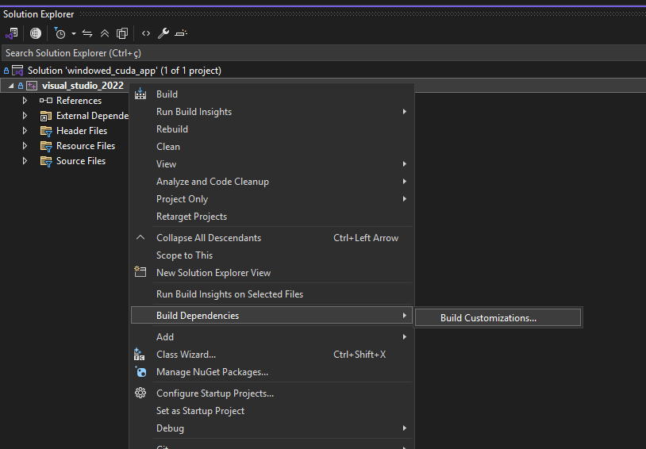
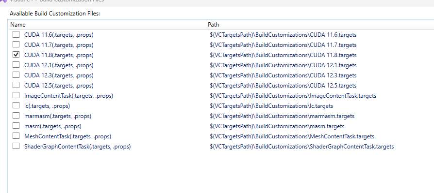
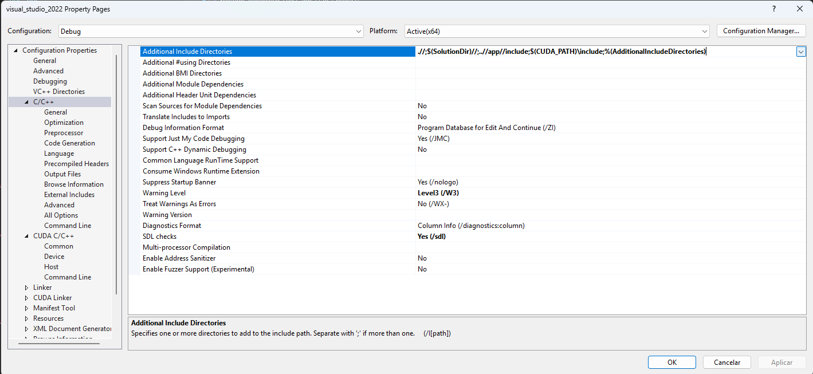
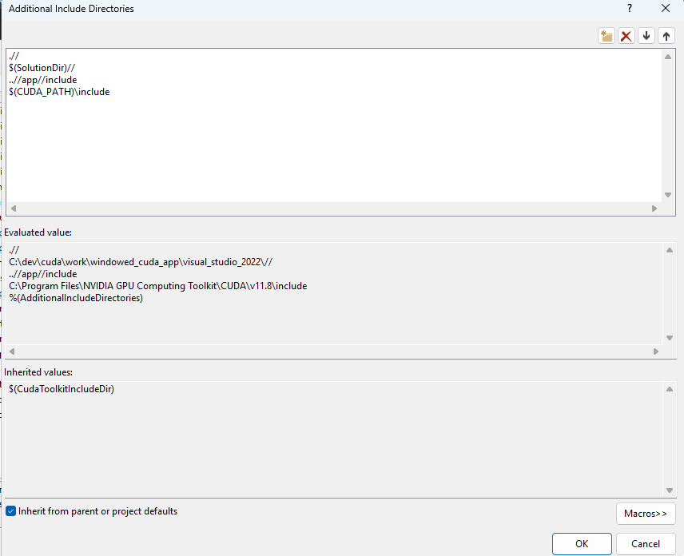
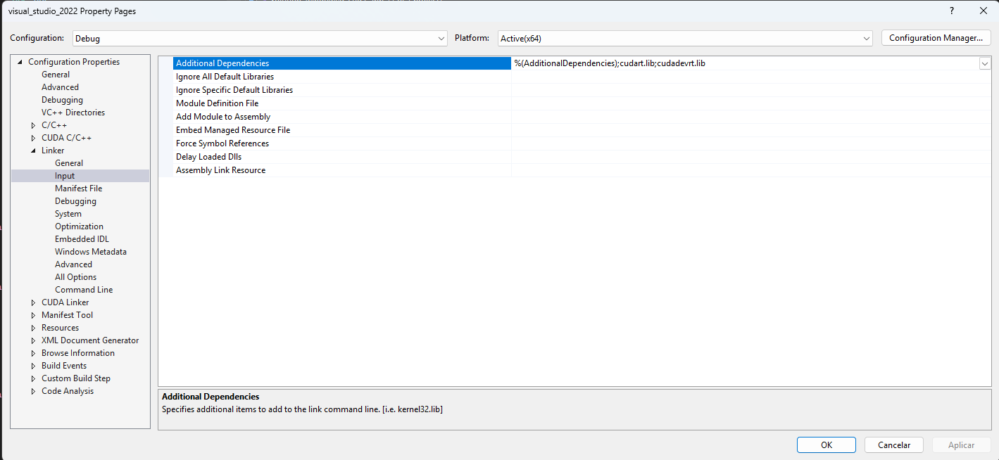
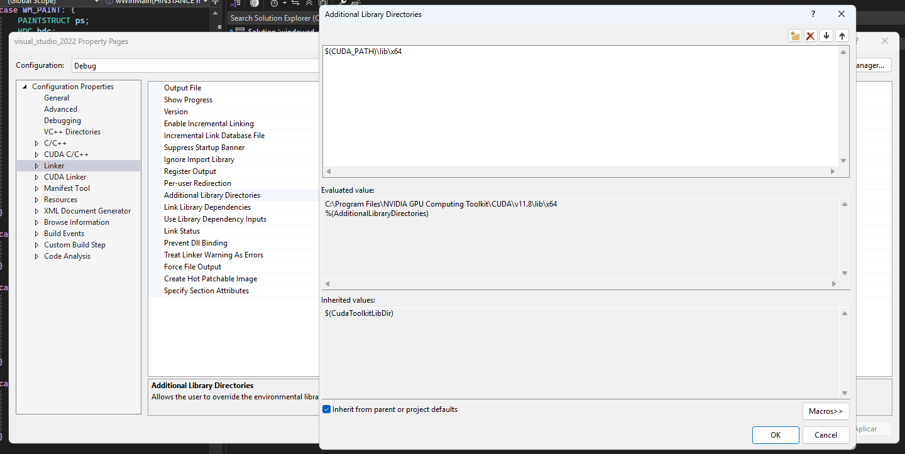
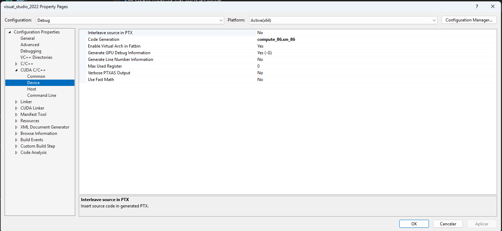
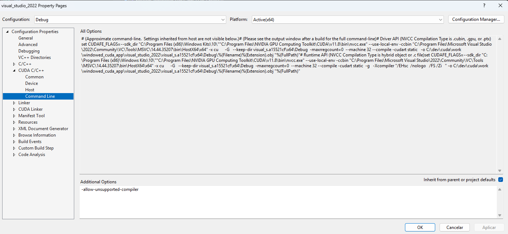
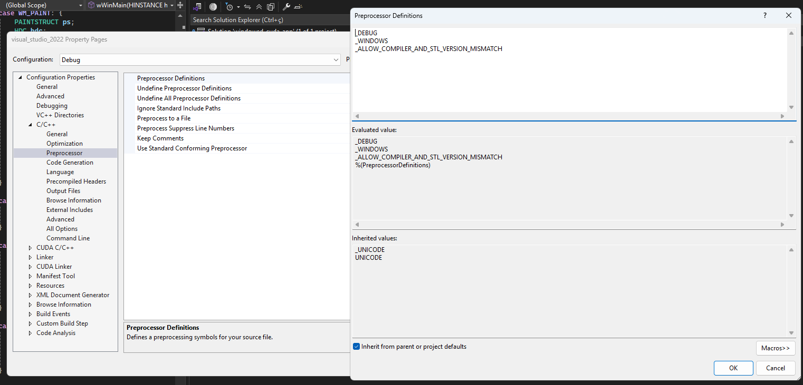

# windowed_cuda_app

a toy project to create a cross platform windowed cuda sample

## [Windows Cuda/HLSL Configurations](#windows-cudahlsl-configurations)
## [Linux Cuda/ComputeShader Configurations](#linux-cudacomputeshader-configurations)
## [MacOs Metal/WebGPU configurations](#macos-metalwebgpu-configurations)


## Late Cuda configuration with pre-existent Visual CPP project

### first add Cuda Tool kit build dependency

## Configuring a C++ Project in Visual Studio for CUDA

Follow these steps to configure a C++ project in Visual Studio to include CUDA support:

### 1. Install Build Dependencies

Ensure you have the necessary build dependencies installed:

- Right Click in yout project -> Build Dependencies->Build Customizations.
- CUDA Toolkit (ensure you have installed cuda sdk before).



### 2. Select correct CUDA SDK Installation

- Confirm that the CUDA SDK is installed correctly.
- Check the $CUDA_PATH installation directory (e.g., `C:\Program Files\NVIDIA GPU Computing Toolkit\CUDA\v11.x`).
- Ensure the `bin`, `lib`, and `include` directories are present.



### 3. Configure C++ Includes

- Open your Visual Studio project configurations.
- Go to **Project Properties** > **Configuration Properties** > **C/C++**.
- Add the **$CUDA_PATH** include directory to the **Include Directories** field:

  ```
  C:\Program Files\NVIDIA GPU Computing Toolkit\CUDA\v11.x\include
  ```



- Ensure the **$CUDA_PATH** environment variable is properly filled, so include it in the C/C++ **Additional Include Directories** under:
  **Configuration Properties** > **C/C++** > **General**.



### 5. Configure Linker Directories

- Navigate to **Configuration Properties** > **Linker** > **General**.
- Add the **$CUDA_PATH** `with lib` directory to the **Additional Library Directories**:

  ```
  C:\Program Files\NVIDIA GPU Computing Toolkit\CUDA\v11.x\lib\x64
  ```



### 6. Add CUDA Libraries

- Go to **Configuration Properties** > **Linker** > **Input**.
- Add the required CUDA libraries to the **Additional Dependencies** field:
  ```
  cudart.lib
  ```



### 7. Set CUDA Code Generation

- Navigate to **Configuration Properties** > **CUDA C/C++** > **Device**.
- Set the **Code Generation** field to match your GPU architecture:

  ```
  compute_XX,sm_XX
  ```

  Replace `XX` with the appropriate compute capability for your GPU.
  check your Compute Capability at this [NVIDIA CUDA GPUs](https://developer.nvidia.com/cuda-gpus)



### 8. Add Additional Command Line Options

- Go to **Configuration Properties** > **CUDA C/C++** > **Command Line**.
- Add any NVCC additional compiler options if needed.
```
-allow-unsupported-compiler 
```



### 9. Define Preprocessor Definitions

- Navigate to **Configuration Properties** > **C/C++** > **Preprocessor**.
- Add any necessary preprocessor definitions for your project.



By following these steps, you can successfully configure a Visual Studio C++ project to include CUDA support.

```
_ALLOW_COMPILER_AND_STL_VERSION_MISMATCH
```


## Linux Cuda Configurations


## MacOs METAL/WebGPU configurations